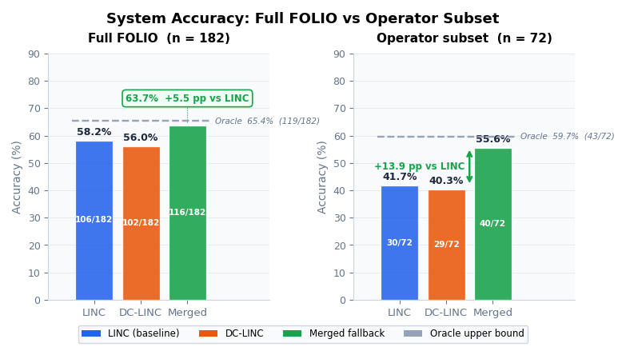
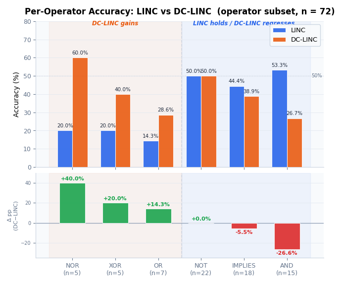
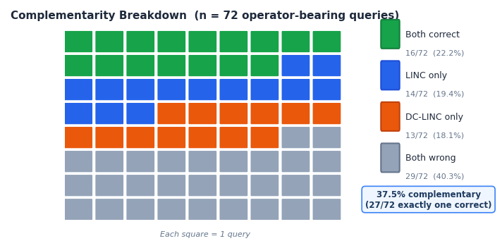
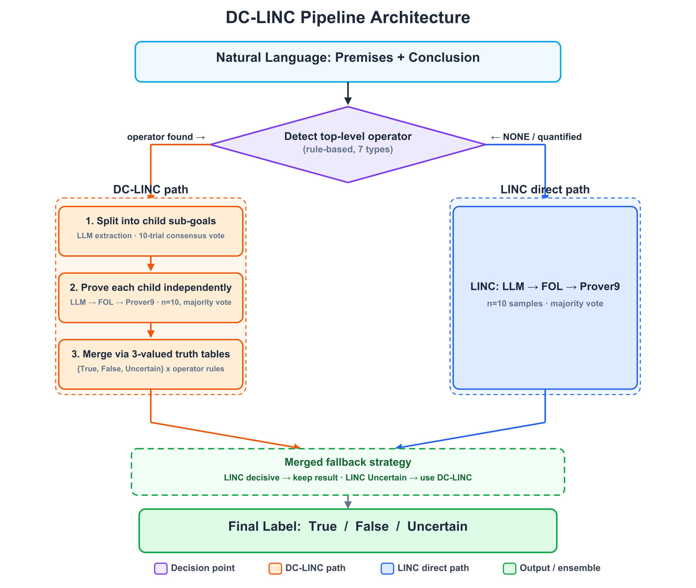
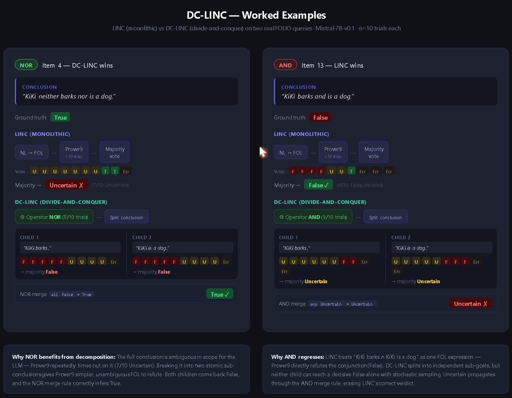
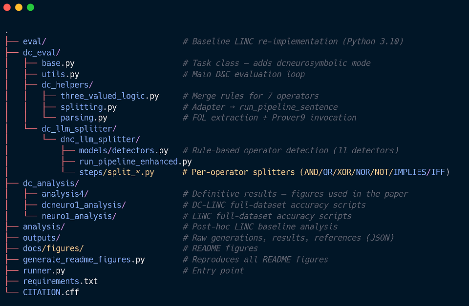

# DC-LINC: Operator-Aware Divide-and-Conquer for Neuro-Symbolic Logical Reasoning

**MSc Computer Science dissertation — University of Bath, 2025.**  
Extends the [LINC](https://arxiv.org/abs/2310.15164) neuro-symbolic pipeline with operator-aware conclusion decomposition, achieving **55.6% accuracy on the FOLIO operator subset** — a **+13.9 pp gain** over the LINC baseline via a zero-parameter fallback ensemble.

[](LICENSE)
[](#citation)

---

## Key results

| System | FOLIO (all 182) | FOLIO (operator subset, n=72) |
|--------|:-:|:-:|
| LINC baseline (re-implemented) | 58.2% (106/182) | 41.7% (30/72) |
| DC-LINC (this work) | 56.0% (102/182) | 40.3% (29/72) |
| **Merged fallback** (this work) | **63.7% (+5.5 pp)** (116/182) | **55.6% (+13.9 pp)** (40/72) |
| Oracle upper bound | 65.4% (119/182) | 59.7% (43/72) |

The fallback is purely rule-based: keep LINC when it returns a decisive answer; use DC-LINC when LINC returns Uncertain. DC-LINC and LINC are complementary on **37.5%** of operator-bearing queries — the structural foundation of the gain.



The gain is not uniform — decomposition helps some operators and hurts others:



NOR/XOR gains are large but sample-small (n=5, all True ground-truth labels) — interpret with caution.  
AND regression is the key failure mode: one Uncertain child drives the full conjunction to Uncertain, overriding LINC's decisive monolithic proofs.



37.5% of the 72 operator-bearing queries are **complementary** — exactly one system is right. This divergence is what the merged fallback exploits.

---

## How it works

LINC translates natural-language premises + conclusion to FOL, then calls the Prover9 theorem prover. When the conclusion carries a top-level logical connective, DC-LINC inserts one decomposition layer before the prover:



**Operator detection is deterministic** — regex + token cues, no LLM involvement.  
**Child text extraction** uses the LLM with operator-specific few-shot prompts, stabilised by a 10-trial majority vote.  
**Quantifier safeguards** prevent splits that would cross binder scopes (e.g. ∀x[P(x) ∧ Q(x)] is treated as atomic).

### Worked examples

Two real FOLIO queries illustrate when decomposition helps and when it hurts:



**NOR (Item 4) — DC-LINC wins:** LINC times out on the full conclusion 7/10 times (Uncertain ✗). DC-LINC splits into "KiKi barks." and "KiKi is a dog.", each returning False by majority vote. NOR merge: all False → **True ✓**.

**AND (Item 13) — LINC wins:** LINC refutes the conjunction monolithically → False ✓ (4/10 decisive). DC-LINC splits into the same two atoms, but neither child reaches a decisive answer alone — both majority-Uncertain. AND merge: any Uncertain → **Uncertain ✗**.

This asymmetry is the structural reason AND is DC-LINC's worst operator (−26.7 pp) while NOR/XOR/OR are its best.

---

## Quick start

### Option 1 — Docker (recommended, includes Prover9)

```bash
docker build -t dc-linc .
docker run --gpus all dc-linc \
  python runner.py \
    --model mistralai/Mistral-7B-v0.1 \
    --tasks folio-dcneurosymbolic-1shot \
    --n_samples 10 \
    --temperature 0.8 \
    --save_results
```

### Option 2 — Conda

```bash
conda create -n linc python=3.10
conda activate linc
pip install -r requirements.txt
```

Prover9/Mace4 must be compiled from source (LADR distribution) and placed on `$PATH`.  
See the Dockerfile for the exact build steps used in this study.

```bash
python runner.py \
  --model mistralai/Mistral-7B-v0.1 \
  --tasks folio-dcneurosymbolic-1shot \
  --n_samples 10 \
  --temperature 0.8 \
  --save_results
```

### Run the LINC baseline

```bash
python runner.py \
  --model mistralai/Mistral-7B-v0.1 \
  --tasks folio-neurosymbolic-1shot \
  --n_samples 10 \
  --temperature 0.8 \
  --save_results
```

### Reproduce the hybrid / per-operator analysis

```bash
cd dc_analysis/analysis4
python hybrid_analysis.py
```

Outputs: per-operator accuracy tables, complementarity breakdown, confusion matrices, and summary report.

**Hardware:** Evaluated on NVIDIA RTX 6000 Ada (62 GB VRAM, HexCloud HPC). Full FOLIO run ~12 hours. Mistral-7B-v0.1 is loaded in fp32 (~29 GB weights); a GPU with **≥40 GB VRAM** is recommended.

---

## Repository layout



---

## Tech stack

| Component | Detail |
|-----------|--------|
| Language | Python 3.10 |
| LLM | Mistral-7B-v0.1 (fp32, temp=0.8, top_p=0.95, top_k=0) |
| Theorem prover | Prover9 (refutation, 10 s timeout) |
| Deep learning | PyTorch 2.6, HuggingFace Transformers 4.54.1, Accelerate 1.9.0 |
| Dataset | FOLIO (Han et al., 2024) — 182 items post-filter, 72 operator-bearing |
| Reproducibility | Docker multi-stage build, pinned deps (`requirements.txt`), fixed seeds, full intermediate output logging |

---

## Citation

```bibtex
@article{rokni2025dclinc,
  title   = {{DC-LINC}: Operator-Aware Divide-and-Conquer for Neuro-Symbolic Logical Reasoning},
  author  = {Rokni, Nufel},
  year    = {2025},
  note    = {arXiv preprint — DOI forthcoming}
}
```

---

*MSc Computer Science, University of Bath, 2024–2025. Supervisor: Dr Mingzhi Dong.*
