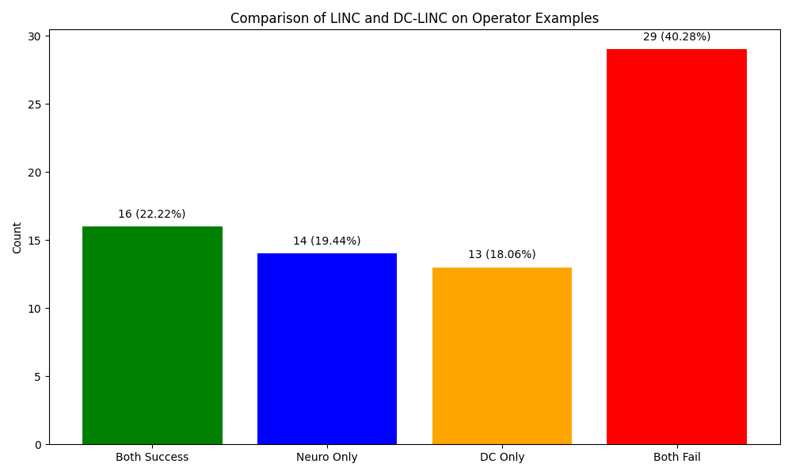
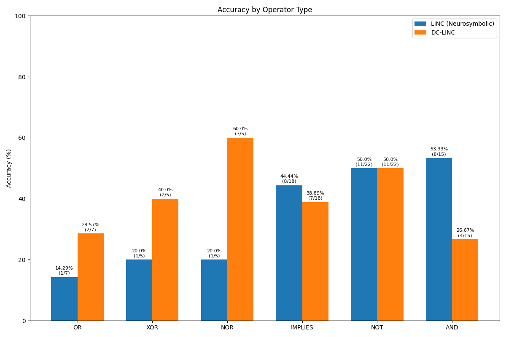
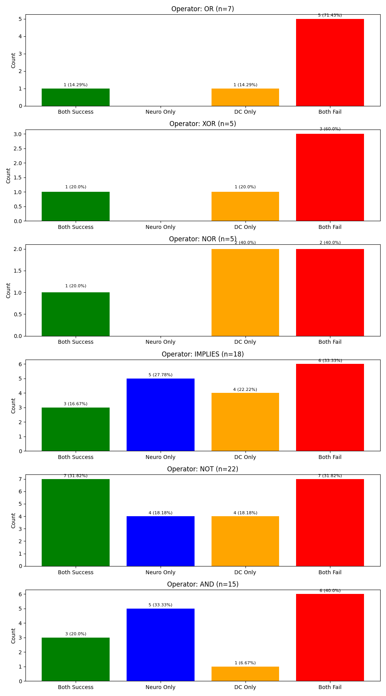

# Comparative Analysis: LINC vs DC-LINC on Logical Operators

This document presents a comparative analysis of the regular LINC (neurosymbolic) and D&C LINC (dcneurosymbolic) models on examples containing logical operators.

## Overall Performance

The analysis covers 72 examples containing different logical operators (OR, XOR, NOR, IMPLIES, NOT, AND).

| Model | Accuracy | Correct Examples |
|-------|----------|-----------------|
| LINC (Neurosymbolic) | 41.67% | 30/72 |
| DC-LINC | 40.28% | 29/72 |

Overall, LINC slightly outperforms DC-LINC by a small margin of 1.39%.

## Success Patterns

The examples were categorized into four groups:
- **Both models correct (22.22%)**: 16 examples where both models predicted correctly
- **Only LINC correct (19.44%)**: 14 examples where only LINC predicted correctly
- **Only DC-LINC correct (18.06%)**: 13 examples where only DC-LINC predicted correctly
- **Both models incorrect (40.28%)**: 29 examples where both models failed

The models agree on their predictions (both correct or both incorrect) in 62.5% of cases, but disagree in 37.5% of cases.

## Operator-Specific Analysis

Performance varies significantly across different logical operators:

| Operator | Sample Size | LINC Accuracy | DC-LINC Accuracy | Difference |
|----------|-------------|---------------|------------------|------------|
| OR | 7 | 14.29% | 28.57% | +14.28% (DC better) |
| XOR | 5 | 20.0% | 40.0% | +20.00% (DC better) |
| NOR | 5 | 20.0% | 60.0% | +40.00% (DC better) |
| IMPLIES | 18 | 44.44% | 38.89% | -5.55% (LINC better) |
| NOT | 22 | 50.0% | 50.0% | 0.00% (Equal) |
| AND | 15 | 53.33% | 26.67% | -26.66% (LINC better) |

## Key Findings

1. **Complementary strengths**: The two approaches have different strengths with respect to logical operators:
   - DC-LINC performs significantly better on NOR (+40%), XOR (+20%), and OR (+14.28%)
   - LINC performs better on AND (-26.66%) and slightly better on IMPLIES (-5.55%)
   - Both perform equally on NOT operators

2. **Potential for ensemble**: The models complement each other on 37.5% of examples, suggesting potential benefits from combining their predictions.

3. **Challenging operators**: Both models struggle with OR, XOR, and NOR operators, with OR being particularly difficult (71.43% joint failure rate).

4. **Best-performing operators**: 
   - LINC performs best on AND (53.33% accuracy) 
   - DC-LINC performs best on NOR (60% accuracy)

## Conclusions

While the overall accuracy difference is small (1.39% in favor of LINC), the models show distinct strengths with different logical operators. DC-LINC appears to handle NOR, XOR, and OR operations better, while LINC is stronger with AND and IMPLIES operations.

The significant complementarity between the models (37.5% of examples where one succeeds and the other fails) suggests that an ensemble approach combining both models could potentially achieve higher performance than either model alone.