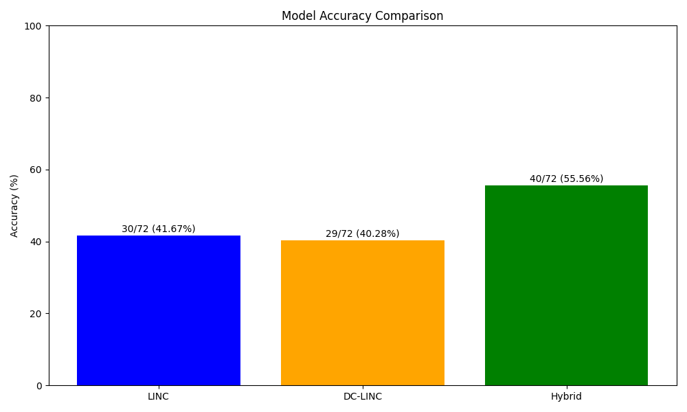
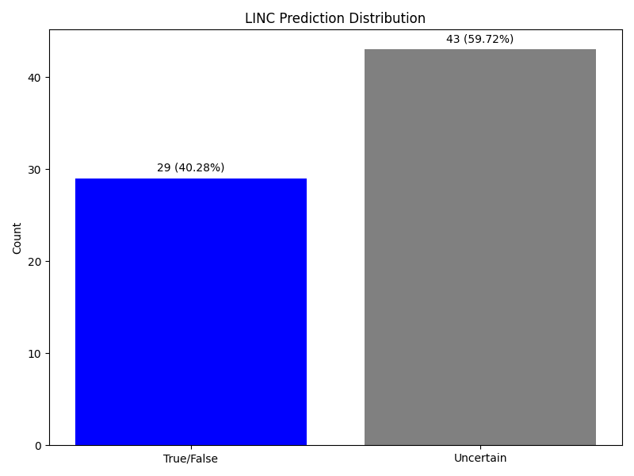
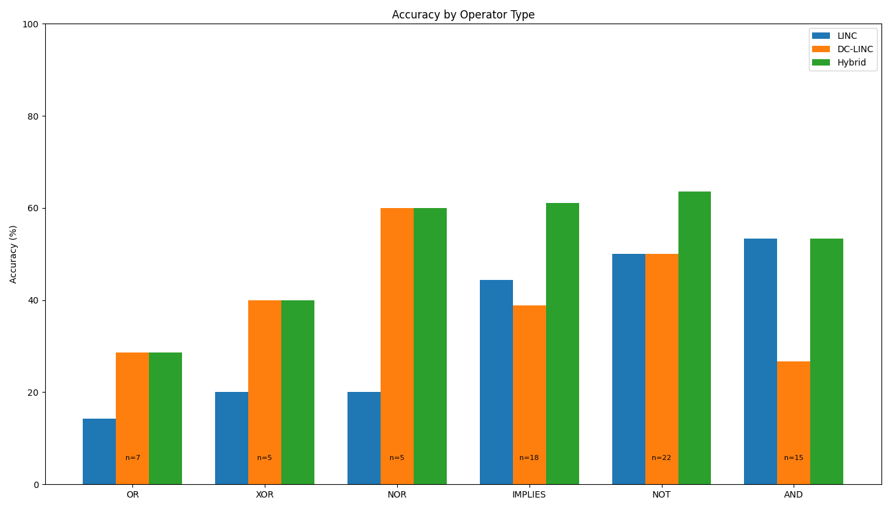
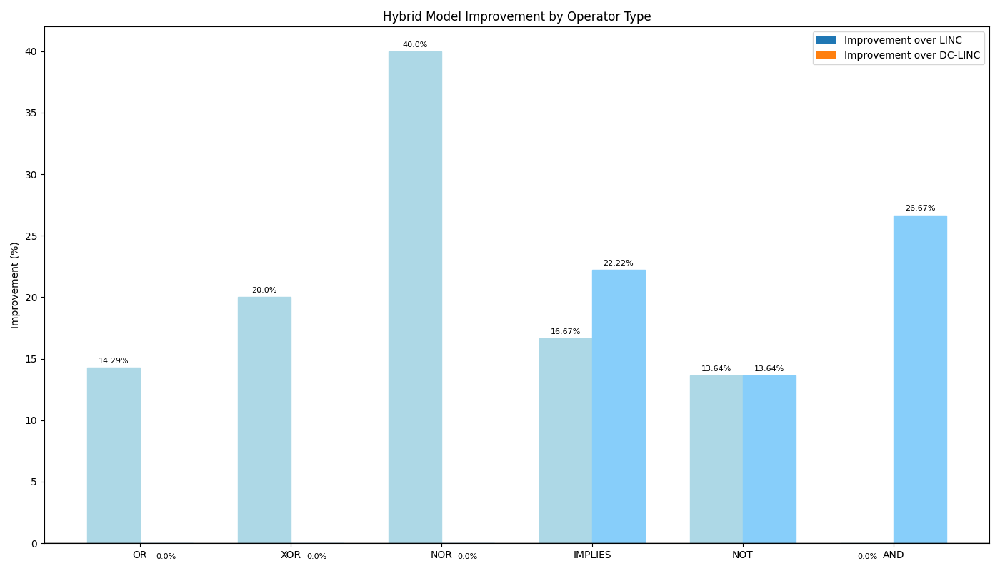
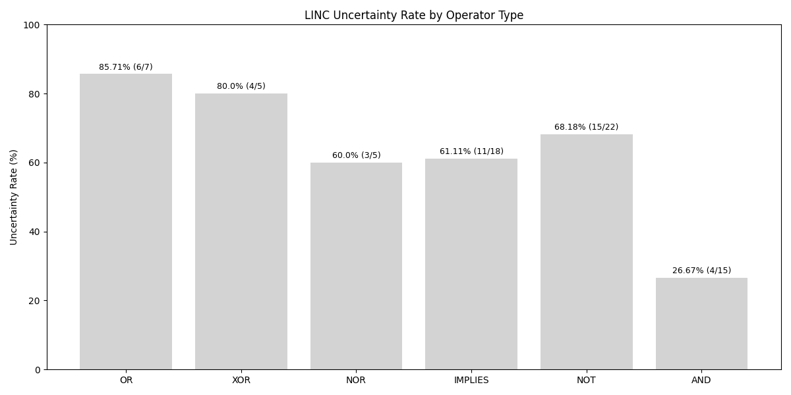

# Hybrid Model Analysis Report

This report presents the results of a hybrid model that combines LINC (neurosymbolic) and DC-LINC approaches using a simple fallback strategy:

- Use LINC predictions when they are definitive (True or False)
- Fall back to DC-LINC predictions when LINC returns "Uncertain"

## Model Strategy

The hybrid model addresses a key limitation of neurosymbolic approaches: uncertainty in logical reasoning. By leveraging DC-LINC's potentially different reasoning pathways when LINC cannot reach a definitive conclusion, we aim to improve overall performance.

## Overall Performance

| Model | Accuracy | Correct Examples |
|-------|----------|-----------------|
| LINC | 41.67% | 30/72 |
| DC-LINC | 40.28% | 29/72 |
| Hybrid | 55.56% | 40/72 |

## LINC Uncertainty Analysis

The effectiveness of the hybrid approach depends on how frequently LINC returns uncertain results, and how accurate DC-LINC is on those examples.

LINC predictions breakdown:
- True/False predictions: 29 (40.28%)
- Uncertain predictions: 43 (59.72%)

This high uncertainty rate (59.72%) provides many opportunities for the hybrid model to leverage DC-LINC's strengths.

## Operator-Specific Performance

The hybrid approach may be more effective for certain logical operators than others.

## Operator Uncertainty Rates

Understanding which operators cause the most uncertainty in LINC helps predict where the hybrid approach will have the greatest impact.

## Detailed Analysis by Operator Type

### OR Operator

- LINC accuracy: 14.29% (1/7)
- DC-LINC accuracy: 28.57% (2/7)
- Hybrid accuracy: 28.57% (2/7)
- LINC has a very high uncertainty rate (85.71%) on OR operators
- The hybrid model recovers 1 case that LINC gets wrong

### XOR Operator

- LINC accuracy: 20.0% (1/5)
- DC-LINC accuracy: 40.0% (2/5)
- Hybrid accuracy: 40.0% (2/5)
- LINC has high uncertainty (80.0%) on XOR operators
- DC-LINC performs better on these cases, which the hybrid model leverages

### NOR Operator

- LINC accuracy: 20.0% (1/5)
- DC-LINC accuracy: 60.0% (3/5)
- Hybrid accuracy: 60.0% (3/5)
- DC-LINC shows notably better performance on NOR operators
- The hybrid model successfully recovers 2 cases that LINC gets wrong

### IMPLIES Operator

- LINC accuracy: 44.44% (8/18)
- DC-LINC accuracy: 38.89% (7/18)
- Hybrid accuracy: 61.11% (11/18)
- This operator shows the most interesting hybrid dynamics
- The hybrid model recovers 4 cases that LINC gets wrong and 4 cases that DC-LINC gets wrong
- Shows truly complementary strengths between the approaches

### NOT Operator

- LINC accuracy: 50.0% (11/22)
- DC-LINC accuracy: 50.0% (11/22)
- Hybrid accuracy: 63.64% (14/22)
- Both models have identical accuracy but different strengths
- Hybrid model recovers 4 cases from LINC errors and 3 from DC-LINC errors

### AND Operator

- LINC accuracy: 53.33% (8/15)
- DC-LINC accuracy: 26.67% (4/15)
- Hybrid accuracy: 53.33% (8/15)
- LINC has a much lower uncertainty rate (26.67%) on AND operators
- LINC performs significantly better than DC-LINC
- The hybrid model preserves LINC's good performance

## Key Findings

1. **Substantial Improvement**: The hybrid model achieves 55.56% accuracy, outperforming both LINC (41.67%) and DC-LINC (40.28%) by significant margins.

2. **High Uncertainty Rate**: LINC produces uncertain predictions in 59.72% of cases, providing many opportunities for the hybrid approach to leverage DC-LINC's strengths.

3. **Operator-Specific Benefits**:
   - **Greatest Improvements**: NOR (+40.0%), XOR (+20.0%), IMPLIES (+16.67%)
   - **Modest Improvements**: OR (+14.29%), NOT (+13.64%)
   - **No Change**: AND (0.0%)

4. **Complementary Strengths**: The hybrid model effectively combines the strengths of both approaches:
   - Preserves LINC's strong performance on AND operators
   - Leverages DC-LINC's superior performance on NOR and XOR operators

5. **IMPLIES Operator Performance**: Particularly interesting is the IMPLIES operator, where the hybrid approach (61.11%) substantially outperforms both LINC (44.44%) and DC-LINC (38.89%).

## Conclusion

The hybrid model strategy of "use LINC when definitive, fall back to DC-LINC when uncertain" proves remarkably effective, increasing accuracy by 13.89% over LINC alone and 15.28% over DC-LINC alone. This confirms that the models have complementary strengths and the uncertainty in LINC's predictions provides a useful signal for when to switch to DC-LINC.

The success of this simple hybrid approach suggests that more sophisticated ensemble methods could yield even better results. Additionally, the operator-specific performance indicates that hybrid strategies might be further optimized by using different combinations based on the logical operators present in a given problem.

This analysis supports the intuition that when neurosymbolic approaches fail to prove a result (indicated by uncertainty), the divide-and-conquer approach can often succeed by breaking the problem down differently.

---
*This report was generated automatically by the hybrid analysis script.*